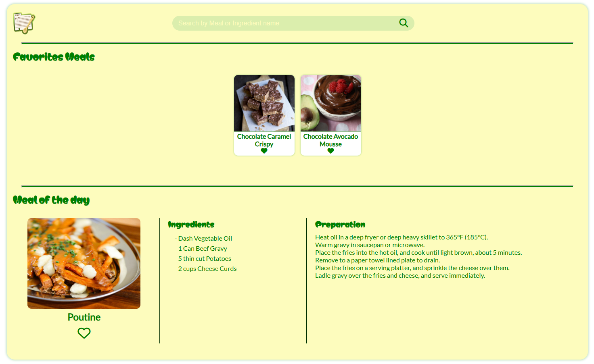

# 🥗 Recipe App

A responsive web application that allows users to search and locally save recipes.  
> 🖥️📱 This project is compatible with both desktop and mobile/touch devices.

---

## 🎯 Description

This project was built **from scratch** as part of my personal learning journey in software development.  
It helped me strengthen my knowledge of:

- HTML
- CSS
- JavaScript
- Fetch API

---

## 📝 How to Use

1. A different **meal of the day** is displayed each time the page is refreshed.
2. Click the **heart icon ❤** to **add a recipe to your favorites**.
3. Click the **heart icon 🤍** again to **remove a recipe from your favorites**.
4. Click on a recipe's image to **view ingredients and instructions**.
5. Use the search bar to **find meals by ingredient** (e.g. "chicken", "chocolate").

Start building your own recipe book today!

---

## 🛠️ Technologies Used

- HTML5
- CSS3
- JavaScript (Vanilla)
- Fetch API

---

## ⚠️ Requirements

- Fully responsive: works perfectly on **desktop and mobile devices**
- Best experienced on **Chrome** or **Firefox**

---

## 👨‍💻 Author

Developed by **Jose Angel Gil**  
GitHub: [@joseangelgil](https://github.com/joseangelgil)

---

## 📷 Screenshot

